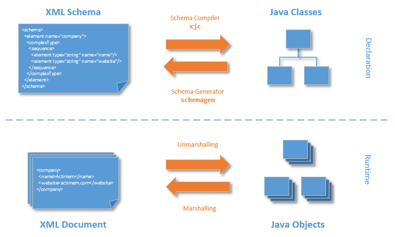

# jaxb-demo

#### JAXB 
* Java Architecture for XML Binding (JAXB) is a software framework that allows Java developers to map Java classes to XML representations. 
* JAXB provides two main features: 
	* the ability to marshal Java objects into XML and the inverse, i.e. to unmarshal XML back into Java objects.


#### User class annotated with JAXB annotations
```
@XmlAccessorType(XmlAccessType.FIELD)
@XmlType(name = "user", propOrder = {
    "id",
    "name",
    "email",
    "password"
})
public class User {

    protected int id;
    @XmlElement(required = true)
    protected String name;
    @XmlElement(required = true)
    protected String email;
    @XmlElement(required = true)
    protected String password;
    ...
}
```

#### Testing
```

		User user = new User();
		user.setId(1);
		user.setName("naresh");
		user.setEmail("naresh@gmail.com");
		user.setPassword("pass123");

		try {

			JAXBContext jaxbContext = JAXBContext.newInstance(User.class);
			Marshaller jaxbMarshaller = jaxbContext.createMarshaller();

			// output pretty printed
			jaxbMarshaller.setProperty(Marshaller.JAXB_FORMATTED_OUTPUT, true);

			jaxbMarshaller.marshal(user, System.out);

		} catch (JAXBException e) {
			e.printStackTrace();
		}
```

#### Output XML:
```
<?xml version="1.0" encoding="UTF-8" standalone="yes"?>
<user>
<name>Naresh</name>
<email>naresh@gmail.com</name>
<password>pass123</password>
</user>
```

#### Dependency
```
<dependency>
	<groupId>javax.xml.bind</groupId>
	<artifactId>jaxb-api</artifactId>
	<version>2.3.1</version>
</dependency> 
```


#### Schema Generator - Generate Classes based on XSD
* user.xsd
```
<xs:schema xmlns:xs="http://www.w3.org/2001/XMLSchema"
	xmlns:tns="http://revature.com/webservice"
	targetNamespace="http://revature.com/webservice"
	elementFormDefault="qualified">

	<xs:element name="user">
		<xs:complexType>
			<xs:sequence>
				<xs:element name="id" type="xs:int"/>
				<xs:element name="name" type="xs:string" />
				<xs:element name="email" type="xs:string" />
				<xs:element name="password" type="xs:string" />
			</xs:sequence>
		</xs:complexType>
	</xs:element>

</xs:schema>
```

#### Generate JAXB classes from XSD 



#### Add Plugin in pom.xml
```
<build>
		<plugins>
			<plugin>
				<groupId>org.codehaus.mojo</groupId>
				<artifactId>jaxb2-maven-plugin</artifactId>
				<version>1.6</version>
				<executions>
					<execution>
						<id>xjc</id>
						<goals>
							<goal>xjc</goal>
						</goals>
					</execution>
				</executions>
				<configuration>
					<schemaDirectory>${project.basedir}/src/main/resources/</schemaDirectory>
					<outputDirectory>${project.basedir}/src/main/java</outputDirectory>
					<clearOutputDir>false</clearOutputDir>
				</configuration>
			</plugin>
		</plugins>
	</build>
  ```


